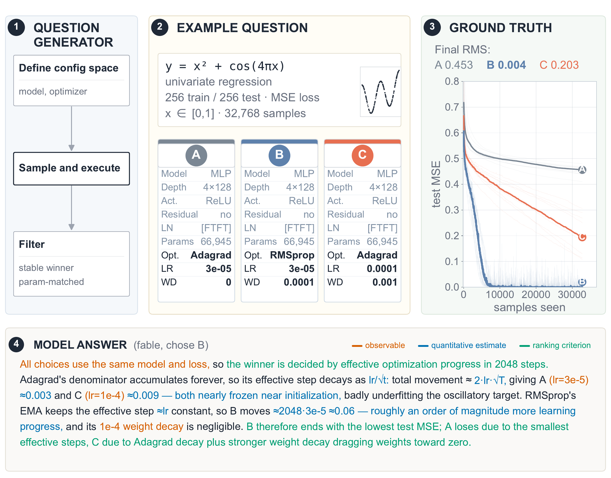
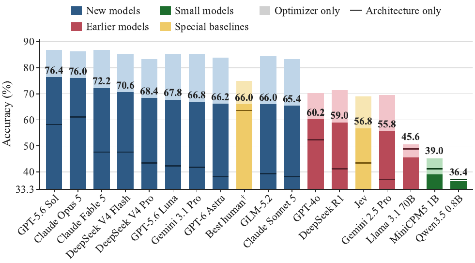
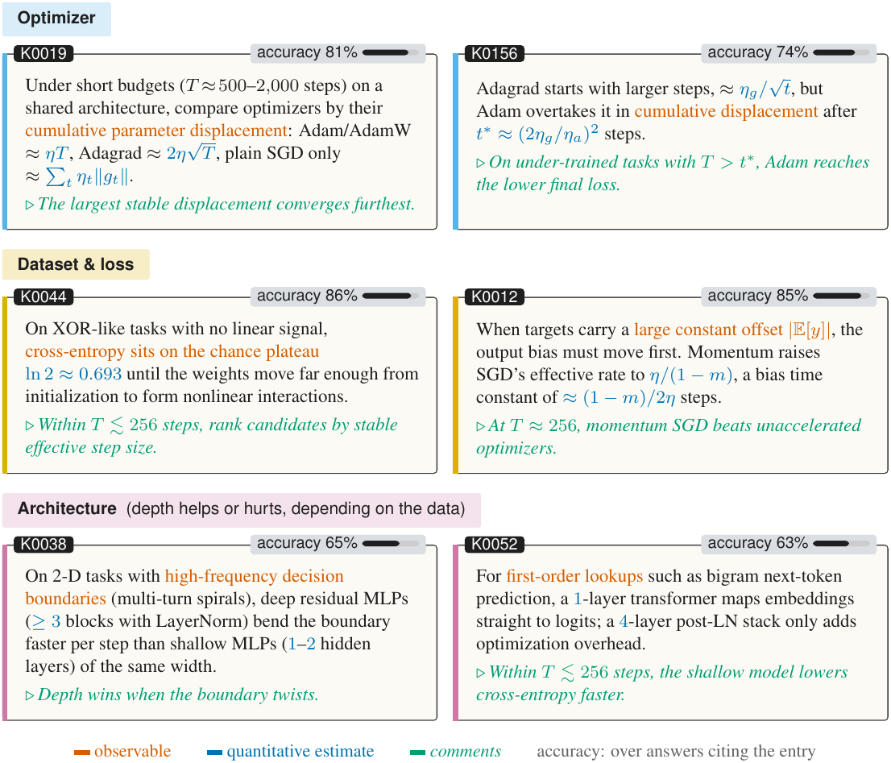
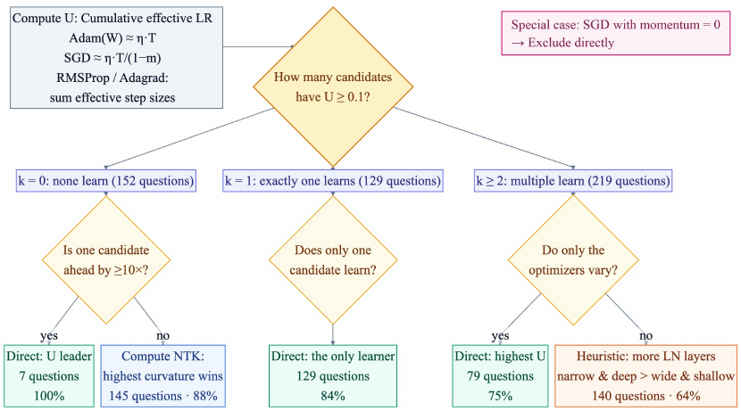
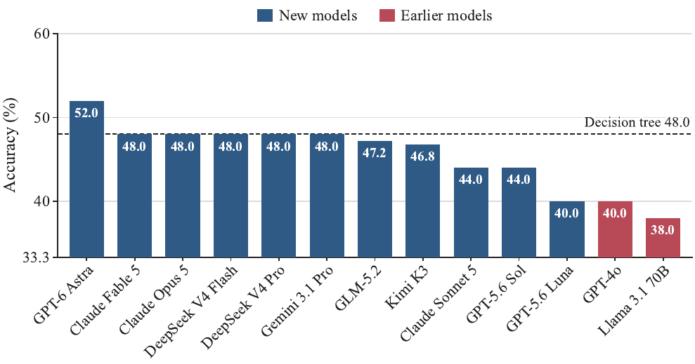

<div align="center">

# ArchitectureIQ: On the Measure of Model Intuition

**Do language models have as good intuition about model training as top AI researchers?**

[](https://raw.githubusercontent.com/renrua52/ArchitectureIQ/main/assets/ArchitectureIQ_paper.pdf)
[](https://github.com/renrua52/ArchitectureIQ)
[](./LICENSE)

Zirui Ren<sup>1,3,\*</sup> · Shaoyang Guo<sup>2,3,\*</sup> · Chencheng Tang<sup>1,3,\*</sup> · Jinxin Wang<sup>3</sup> · Chengyu Xiong<sup>2,3</sup> · Shanbin Yu<sup>1,3</sup> · Peihang Li<sup>3,4</sup> · Yidi Wu<sup>2,3</sup> · Bangzhe Huang<sup>3,5</sup> · Qingyu Qu<sup>1,3</sup> · Leqian Yang<sup>3,6</sup> · Ziming Liu<sup>1,3,7</sup>

<sup>1</sup>Tsinghua University · <sup>2</sup>Peking University · <sup>3</sup>MetaCircle · <sup>4</sup>UC Berkeley · <sup>5</sup>Fudan University · <sup>6</sup>USTC · <sup>7</sup>Shanghai Qizhi Institute · <sup>\*</sup>equal contribution

</div>

<p align="center">
  <a href="https://raw.githubusercontent.com/renrua52/ArchitectureIQ/main/assets/ArchitectureIQ_paper.pdf">
    
  </a><br>
  <b>Figure 2 — ArchitectureIQ overview.</b> A synthetic dataset and several candidate training recipes are rendered as executable programs; running them across random seeds establishes the ground-truth winner. The evaluated model receives the dataset and recipe descriptions and predicts which candidate will achieve the best test metric. <a href="https://raw.githubusercontent.com/renrua52/ArchitectureIQ/main/assets/ArchitectureIQ_paper.pdf">Paper, Fig. 2 ↗</a>
</p>

---

## TL;DR — four findings

Each ArchitectureIQ question presents a synthetic dataset and several training recipes (model + optimizer + loss + budget); the test-taker must predict which recipe yields the best test metric after its stated budget. On the 500-question, three-choice benchmark (chance 33.3%):

1. **Intuition is imperfect — sometimes sub-human.** Frontier models reach ~76% overall vs. 66.0% for the best human researcher, yet remain far from perfect; on architecture-only questions the best human scores 65% while GPT-6 Astra scores 38%.
2. **Intuition is empirical, not structured.** More chain-of-thought compute yields no consistent accuracy gain — unlike math, there is no "Science of AI" language for structured reasoning about training.
3. **Intuition is not maximally condensed.** Extracted propositions compress into a knowledge base: with only 20 items, GPT-4o almost matches Claude Opus 5.
4. **Intuition is insensitive to dataset properties.** The "best model" should depend on the data; that models (and humans) fail to adapt suggests data is the real "dark matter" of AI. The [AIQ-Hard50 suite](#aiq-hard50-data-flip) makes this concrete: once the winner must depend on the data, the 50% data-blind bound becomes a hard barrier.

## Main results

<p align="center">
  <a href="https://raw.githubusercontent.com/renrua52/ArchitectureIQ/main/assets/ArchitectureIQ_paper.pdf">
    
  </a><br>
  <b>Figure 1 — Accuracy on the 500-question, three-choice benchmark.</b> Printed numbers are overall accuracy; the light cap marks optimizer-only accuracy and the horizontal rule architecture-only accuracy. The best human (†) is measured on a fixed 50-question subset. <a href="https://raw.githubusercontent.com/renrua52/ArchitectureIQ/main/assets/ArchitectureIQ_paper.pdf">Paper, Fig. 1 ↗</a>
</p>

## Knowledge accumulation

<p align="center">
  <a href="https://raw.githubusercontent.com/renrua52/ArchitectureIQ/main/assets/ArchitectureIQ_paper.pdf">
    
  </a><br>
  <b>Figure 6 — Knowledge-base snapshot.</b> Six entries from the final accumulated knowledge base of transferable training principles. <a href="https://raw.githubusercontent.com/renrua52/ArchitectureIQ/main/assets/ArchitectureIQ_paper.pdf">Paper, Fig. 6 ↗</a>
</p>

## Analytical policy

<p align="center">
  <a href="https://raw.githubusercontent.com/renrua52/ArchitectureIQ/main/assets/ArchitectureIQ_paper.pdf">
    
  </a><br>
  <b>Figure 8 — Analytical decision tree.</b> A hand-readable update-regime policy distilled from the benchmark; the underlying development-stage policy reaches 78.2% dataset-grouped out-of-fold top-1 accuracy (391/500). <a href="https://raw.githubusercontent.com/renrua52/ArchitectureIQ/main/assets/ArchitectureIQ_paper.pdf">Paper, Fig. 8 ↗</a>
</p>

## AIQ-Hard50: data flip

<p align="center">
  <a href="https://raw.githubusercontent.com/renrua52/ArchitectureIQ/main/assets/ArchitectureIQ_paper.pdf">
    
  </a><br>
  <b>Figure 9 — AIQ-Hard50 accuracy.</b> Dashed line: decision tree trained on the main benchmark (48.0%). Chance 33.3%; data-blind bound 50%. <a href="https://raw.githubusercontent.com/renrua52/ArchitectureIQ/main/assets/ArchitectureIQ_paper.pdf">Paper, Fig. 9 ↗</a>
</p>

AIQ-Hard50 is the **data-flip** companion suite: questions are constructed so that the ground-truth winner **depends on the dataset itself**, not only on the training recipe. Once the answer is tied to data properties, recipe-level heuristics stop working and the questions become dramatically harder — **50% is the barrier**: it is the data-blind upper bound, the best accuracy achievable without using any dataset-specific information (chance is 33.3%). Even the decision tree trained on the main benchmark only reaches 48.0% here, below that bound.

## Citation

```bibtex
@misc{ren2026architectureiq,
  title         = {ArchitectureIQ: On the Measure of Model Intuition},
  author        = {Ren, Zirui and Guo, Shaoyang and Tang, Chencheng and Wang, Jinxin
                   and Xiong, Chengyu and Yu, Shanbin and Li, Peihang and Wu, Yidi
                   and Huang, Bangzhe and Qu, Qingyu and Yang, Leqian and Liu, Ziming},
  year          = {2026},
  publisher     = {MetaCircle},
  howpublished  = {\url{https://github.com/renrua52/ArchitectureIQ}}
}
```

---

# Repository guide

A prototype benchmark for the **modeling intuition** of LLMs (and humans): given a dataset instance and several **candidates** (model + optimizer + loss + budget), pick which **choice** achieves the best selection metric after its stated training budget.

Design: [plan-v2.md](./docs/architecture/plan-v2.md) · Terminology: [AGENTS.md](./AGENTS.md#terminology)

Interactive experiment report: [README.html](./README.html) (Chinese).

## AI agent instructions

If you use **Cursor**, **Claude Code**, or other coding agents on this repo, make sure they use [AGENTS.md](./AGENTS.md) or [CLAUDE.md](./CLAUDE.md).

## Start the quiz

**Product UI (React):** static BakeFile under `frontend/quiz/`. See
[`docs/FRONTEND_BACKEND.md`](./docs/FRONTEND_BACKEND.md) and
[`contracts/README.md`](./contracts/README.md).

```bash
cd frontend/quiz
npm install
npm run dev
```

Open <http://127.0.0.1:5173/>. Optional: copy
`contracts/examples/mini_bake.json` over `frontend/quiz/public/data/questions.json`
for a 4-question fixture.

Validate any BakeFile:

```bash
.venv/bin/python -m pip install -e ".[dev]"
.venv/bin/python tools/validate_quiz_bake.py
```

### Legacy Streamlit inspector (frozen)

The Streamlit question inspector is **frozen** — no new product features. Prefer
the React quiz above. For archaeological local inspection only:

```bash
.venv/bin/python tools/start_quiz.py
```

Windows PowerShell:

```powershell
.\.venv\Scripts\python.exe tools\start_quiz.py
```

The legacy launcher opens <http://127.0.0.1:8501>. On a fresh clone it may copy a
bundled demo question into gitignored `data/`.

### First-time setup

```bash
python3 -m venv .venv
.venv/bin/python -m pip install -e ".[dev,inspector]"
```

Windows PowerShell:

```powershell
py -3 -m venv .venv
.\.venv\Scripts\python.exe -m pip install --upgrade pip
.\.venv\Scripts\python.exe -m pip install -e ".[dev,inspector]"
```

Requires Python 3.10+ and PyTorch 2.x.

### CPU and CUDA installation

The `pyproject.toml` dependency list is the package dependency source of
truth. The default `requirements.txt` is a CPU-oriented convenience entry
point used by Streamlit Community Cloud and other CPU-only deployments. For
local development, the editable install above uses the PyTorch wheel selected
by pip.

For CUDA, install a PyTorch build matching the installed NVIDIA driver and
the CUDA version supported by that build, then install this project:

```powershell
.\.venv\Scripts\python.exe -m pip install --upgrade --force-reinstall torch --index-url https://download.pytorch.org/whl/cu121
.\.venv\Scripts\python.exe -m pip install -e ".[dev,inspector]"
```

Replace `cu121` with the CUDA wheel index required by the selected PyTorch release. Verify with `python -c "import torch; print(torch.cuda.is_available())"`.

Execution artifacts are device-specific. Do not mix CPU and CUDA candidate
artifacts in one candidate set or question, and do not treat their ground
truth values as directly interchangeable. `--device cuda` is strict: when
CUDA is unavailable, candidate generation fails explicitly instead of
silently falling back to CPU.

## Generate benchmark artifacts

Activate the virtual environment, then create datasets, candidate sets, and
questions through the interactive CLI:

```bash
source .venv/bin/activate

# PowerShell equivalent: .\.venv\Scripts\Activate.ps1

# Create a dataset
architecture-iq create-dataset -i

# Generate a candidate set
architecture-iq generate-candidates -i

# Assemble questions from one or more candidate sets
architecture-iq generate-question -i

# Evaluate an LLM on generated questions
python tools/llm_eval/run.py --model gpt-4o-mini
```

Artifacts are written under `data/` (gitignored).

## Dataset families

Every registered family, one benchmark bucket each. `Models` is what sampling
actually draws (the intersection of `pools.model_types` with the family's
`compatible_model_types()`).

| Family | Task | Models | Loss | Metric |
|--------|------|--------|------|--------|
| `univariate_regression` | R → R symbolic regression | `mlp` | MSE | `test_mse` |
| `multivariate_regression` | R^n → R symbolic regression | `mlp` | MSE | `test_mse` |
| `bigram_lm` | Next-token prediction from fixed P(y\|x) | `transformer_lm`, `gru_lm` | cross-entropy | `test_ce` |
| `synthetic_tabular_classification` | Tabular binary classification from a sampled score-threshold rule (`smooth_additive`, `sparse_interaction`, `piecewise_boundary`) | `mlp` | cross-entropy | `test_ce` |
| `xor_classification` | Tabular binary classification, XOR decision boundary plus distractor coordinates | `mlp` | cross-entropy | `test_ce` |
| `spiral_classification` | Two interleaved Archimedean spirals in 2-D, labelled by generative arm | `mlp` | cross-entropy | `test_ce` |

`xor_classification` and `spiral_classification` are families of their own as of
`v1.4`. Before that they were two of five `rule_families` inside
`synthetic_tabular_classification`, which put five very different difficulties in
one bucket; artifacts generated then still load and still bucket correctly.

The `v1` pool (the CLI default) enables the first four families and also offers
the `mse_l1` / `mse_l2` / `cross_entropy_l1` / `cross_entropy_l2` variants;
`v1.4` enables all six and samples only plain `mse` / `cross_entropy`, leaving
regularisation to optimizer `weight_decay`.

For `multivariate_regression`, **n** (input dimension) defaults to a random pick from the profile pool `input_dims: [2, 3, 4, 5, 8]`. Pin it with `--input-dim` or the interactive prompt.

Config per family lives under `dataset_configs` in the profile you pass.

`v1` is still the CLI default and enables every family that existed when it was
written. `v1.4` is the current generation profile: all six families, one shared
activation and residual flag per MLP, plain losses only, all-10-seed
significance, and generation-time parameter banding. Older `v2*` pilot profiles
remain for historical experiments.

## CLI reference

All commands accept `--profile NAME` (`v1` is the default). Run `architecture-iq --help` or `architecture-iq <command> --help` for details.

Interactive mode (`-i` / `--interactive`) prompts for every parameter. **Enter** on a choice field picks a random valid option. Interactive commands reject all other arguments except `--profile`. `generate-candidates -i` and `generate-question -i` only let you pick **existing** datasets (use `create-dataset` first).

### `create-dataset`

Create a new dataset instance under `data/datasets/{family}/{dataset_id}/`.

```bash
architecture-iq create-dataset --family univariate_regression --seed 42
architecture-iq create-dataset --random-family --seed 42
architecture-iq create-dataset --family multivariate_regression --seed 42 --input-dim 4
architecture-iq create-dataset -i
```


| Option                | Default               | Description                                              |
| --------------------- | --------------------- | -------------------------------------------------------- |
| `--seed`              | `0` (non-interactive) | Instance seed for dataset generation (see below)         |
| `--family`            | —                     | **Required** unless `--random-family` or `-i`            |
| `--random-family`     | off                   | Pick a random family from the profile pool               |
| `--input-dim`         | —                     | For `multivariate_regression` only: pin **n** (must be in profile `input_dims`) |
| `-i`, `--interactive` | off                   | Prompt for family, seed, and multivariate **n** (Enter = random from pool) |

**Multivariate input dimension.** By default, `multivariate_regression` samples **n** from the active profile's `dataset_configs.multivariate_regression.input_dims` (currently `[2, 3, 4, 5, 8]` in V1 and V2). Use `--input-dim` or `-i` to pin **n**; otherwise it is chosen randomly from that list (seeded by instance seed).

**What `--seed` controls:** the **instance seed** for synthetic data generation (expression formula and train/test point sampling). Same `--family` + same `--seed` reproduces the same dataset. It does **not** affect which family is picked when using `--random-family` (that draw uses a separate unseeded RNG).


### `generate-candidates`

Generate a named candidate set with ground truth. Each run writes candidates under `data/datasets/{family}/{dataset_id}/candidates/{set_name}/` where `set_name` looks like `set_{budget}_{model}_{optimizer}_{loss}_{hash}` (`var` or `fix` per axis).

```bash
architecture-iq generate-candidates data/datasets/univariate_regression/sym_XXXXXX \
  --budget 1024 --count 32 --vary model --vary optimizer --device cpu
architecture-iq generate-candidates -i
```


| Option                | Default                        | Description                                                  |
| --------------------- | ------------------------------ | ------------------------------------------------------------ |
| `dataset_path`        | **required** (non-interactive) | Path to dataset instance dir                                 |
| `--budget`            | **required** (non-interactive) | `total_samples_seen`                                         |
| `--count`             | **required** (non-interactive) | Number of candidates in this set                             |
| `--vary`              | **required** (non-interactive) | Repeat: `model`, `optimizer`, or `loss` (axes that may vary) |
| `--device`            | profile/default               | Execution device for new candidates: `cpu` or `cuda`        |
| `--seed`              | `0`                            | RNG seed for candidate sampling (see below)                    |
| `-i`, `--interactive` | off                            | Prompt for varying/invariant axes and fixed values           |

**What `--seed` controls:** the RNG for **sampling candidate specs**—which models/optimizers/losses are drawn on varying axes, and (in non-interactive mode) the random picks for invariant axes and batch size. It also salts the set directory name (`set_…_{hash}`). The seed is stored in `set.json`. It does **not** control ground-truth training seeds (those come from the profile's `base_seed` / `n_seeds`) or the dataset itself.

**Non-interactive vs `-i`.** Both modes use the same sampling and ground-truth pipeline. The difference is control over **invariant** axes (everything not listed in `--vary`, plus batch size, which never varies within a set):

- **Non-interactive:** invariant values are chosen **randomly once** per set, seeded by `--seed`. For example, `--vary model` fixes one optimizer and one loss for all candidates without prompting.
- **`-i`:** you are prompted to **pin** each invariant axis (model, optimizer, loss, batch size). **Enter** on a prompt accepts the same random sample non-interactive mode would use.

Interactive mode is not a different generator—it is strictly **more expressive** for pinning fixed components. There are no CLI flags today to pass those pins without `-i`.

### `generate-question`

Assemble one or more multiple-choice questions from candidate set(s) and write `prompt.txt`. Each invocation creates a run folder under `data/datasets/{family}/{instance}/questions/run_{n}q_{c}c_{hash}/` containing `run.json` and one directory per question. Question type is inferred automatically from the chosen candidates' specs.

```bash
architecture-iq generate-question data/datasets/univariate_regression/sym_XXXXXX \
  data/datasets/univariate_regression/sym_XXXXXX/candidates/set_1024_var_fix_fix_XXXXXX \
  --num-questions 5

# Multiple sets (e.g. different budgets or varying axes)
architecture-iq generate-question data/datasets/univariate_regression/sym_XXXXXX \
  data/datasets/.../candidates/set_1024_var_fix_fix_AAAAA \
  data/datasets/.../candidates/set_2048_fix_var_fix_BBBBB \
  --num-questions 3

architecture-iq generate-question -i
```


| Option                | Default                        | Description                                    |
| --------------------- | ------------------------------ | ---------------------------------------------- |
| `dataset_path`        | **required** (non-interactive) | Path to dataset instance dir                   |
| `candidate_sets`      | **required** (non-interactive) | One or more candidate set dirs                 |
| `--num-questions`     | **required** (non-interactive) | Questions to generate from the union pool      |
| `--num-choices`       | profile (`2`)                  | Choices per question (letters A, B, …)         |
| `--seed`              | `0`                            | RNG seed for question assembly (see below)     |
| `-i`, `--interactive` | off                            | Prompt for dataset, candidate sets, and counts |

**What `--seed` controls:** the RNG for **assembling questions from existing candidate set(s)** (no ground truth is re-run). Specifically:

- **Subset selection** — when more significant subsets exist than `--num-questions`, which ones are kept (order after shuffling the passing list).
- **Letter assignment** — shuffles which choice letter (A, B, …) each candidate gets; the significance winner stays correct but its letter may move.
- **Run folder name** — salts the `run_{n}q_{c}_{hash}` directory name.

The seed is stored in `run.json`. For typical pool sizes, subset search is exhaustive and deterministic aside from these shuffle steps. If the pool is very large, the seed also drives random combo sampling when exhaustive search is skipped. It does **not** change candidate metrics, which subsets pass significance, or which candidate is the correct answer.


## Typical workflows

### Architecture-only questions

Generate a set where only the model varies, then assemble questions.

```bash
architecture-iq create-dataset --family univariate_regression --seed 0
architecture-iq generate-candidates data/datasets/univariate_regression/sym_XXXXXX \
  --budget 1024 --count 32 --vary model
architecture-iq generate-question data/datasets/univariate_regression/sym_XXXXXX \
  data/datasets/univariate_regression/sym_XXXXXX/candidates/set_1024_var_fix_fix_XXXXXX \
  --num-questions 5
```

### Cross-budget mixed questions

Generate separate sets (e.g. different budgets or varying axes), then pass all set paths to `generate-question`.

```bash
architecture-iq create-dataset --family univariate_regression --seed 0
architecture-iq generate-candidates data/datasets/univariate_regression/sym_XXXXXX \
  --budget 1024 --count 32 --vary model --vary optimizer --vary loss
architecture-iq generate-candidates data/datasets/univariate_regression/sym_XXXXXX \
  --budget 2048 --count 32 --vary model --vary optimizer --vary loss
architecture-iq generate-question data/datasets/univariate_regression/sym_XXXXXX \
  data/datasets/.../candidates/set_1024_var_var_var_XXXXXX \
  data/datasets/.../candidates/set_2048_var_var_var_YYYYY \
  --num-questions 5
```

### Interactive session

```bash
architecture-iq create-dataset -i
architecture-iq generate-candidates -i
architecture-iq generate-question -i
```

## Layout

```
profiles/v1.yaml          # V1 profile (pools, grids, ground-truth settings)
AGENTS.md                 # AI agent development guide (canonical)
CLAUDE.md                 # Same as AGENTS.md (Claude Code)
docs/                     # Architecture, plans, reports, and release records
prompts/templates/        # NL prompt templates
src/architecture_iq/      # Pipeline: datasets, candidates, ground truth, questions
tools/llm_eval/           # Standalone LLM evaluation runner
tools/ranking_questions/  # Calibration-plus-ranking generation and scoring
tools/*analysis*.py       # Offline curve/order-parameter analysis
templates/                # Reusable HTML report template
data/                     # Generated datasets, candidates, questions (runtime)
llm_runs/                 # LLM evaluation runs (runtime)
```

## Reproducibility

Ground truth **executes the on-disk Python files**, not parallel framework shortcuts:

- **Datasets:** `synthesize.py` is loaded via `importlib` and `synthesize()` materializes `train.pt` / `test.pt`.
- **Candidates:** `train.py` imports `model.py`, `optimizer.py`, and `loss.py` from the same folder. The runner calls `train_and_eval()` in `train.py`. Before each run, `.py` files are regenerated from `candidate_spec.json` so specs and code stay aligned.

See `src/architecture_iq/runtime/loader.py`.

## Question inspector (frozen)

> **Frozen.** Do not add product features here. The public/internal quiz path is
> `frontend/quiz/` + BakeFile (`contracts/`). See
> [`docs/FRONTEND_BACKEND.md`](./docs/FRONTEND_BACKEND.md).

Streamlit UI for browsing and taking questions. Original benchmark artifacts remain
read-only; user-created training settings are stored separately under the current
question's `custom_settings/` directory.

While solving, expand **Add custom setting** to choose the architecture, optimizer,
loss, training budget, and seed count. Confirming the form trains that setting on the
current dataset and adds its learning curve to the page. A custom setting can inherit
all editable values from Choice A/B/C. The inspector retains at most two custom runs:
the newest run and the historical run with the lowest final loss.

The startup command at the top opens the default question. To open a specific
question or question run first, pass its path to the launcher:

```bash
.venv/bin/python tools/start_quiz.py --question-run data/datasets/univariate_regression/sym_XXXXXX/questions/run_5q_2c_XXXXXX/q_XXXXXX
.venv/bin/python tools/start_quiz.py --question-run data/datasets/univariate_regression/sym_XXXXXX/questions/run_5q_2c_XXXXXX
```

See [tools/question_inspector/README.md](./tools/question_inspector/README.md).

## Ranking questions and analysis tools

Generate calibration-plus-ranking tasks, create de-identified agent bundles,
and score predicted orders by inversion count:

```bash
python tools/ranking_questions/generate.py <candidate-set> --layout anchored
python tools/ranking_questions/make_blind_bundle.py <run> <public-bundle> \
  --answer-key-output <private-key.json>
python tools/ranking_questions/score_answers.py <run> <answers.json>
```

Additional offline utilities:

- `tools/analyze_order_parameters.py` summarizes trained candidate curves.
- `tools/evaluate_arithmetic_rules.py` evaluates deterministic selection rules.
- `tools/make_single_question_blind_quiz.py` builds isolated single-question bundles.
- `tools/build_readme_case_assets.py` rebuilds the case-study data used by
  [README.html](./README.html).

Generated analysis and ranking runs under `artifacts/` are gitignored. See
[tools/ranking_questions/README.md](./tools/ranking_questions/README.md) for the
ranking workflow and leakage precautions.

## LLM evaluation

Standalone runner that sends question prompts to an OpenAI-compatible chat API, parses the model's letter answer from an `<answer>` tag, and scores against ground truth. Does not import `architecture_iq`; reads question artifacts under `data/` (dataset-scoped runs and legacy `data/questions/`).

Prompts are augmented at eval time so the model can reason freely, then commit with e.g. `<answer>B</answer>`. The full raw response is stored before parsing.

Set API credentials (any OpenAI-compatible host):

```bash
export OPENAI_API_BASE="..."
export OPENAI_API_KEY="sk-..."
```

Run over all questions under `data/` (default), a question run folder, or legacy `data/questions/`:

```bash
python tools/llm_eval/run.py --model gpt-4o-mini
python tools/llm_eval/run.py data/datasets/univariate_regression/sym_XXXXXX/questions/run_5q_2c_XXXXXX --model gpt-4o-mini
python tools/llm_eval/run.py --model gpt-4o-mini --temperature 0 --limit 10 --workers 8
```

Each run writes under `llm_runs/{timestamp}_{model}/`:

- `run.json` — model config and accuracy summary
- `results/{question_id}.json` — per-question ground truth, parsed letter, raw response, and chain-of-thought (when present)

Use `--run-dir path/to/run --skip-existing` to resume a partial run.

See [tools/llm_eval/README.md](./tools/llm_eval/README.md).

### Context-protocol boundary

The historical local revealed-answer runner and its old `llm_runs/` artifacts
are reproducibility references only. They append compact prior answer/outcome
lines to later API prompts and should not be used as the current `main` context
benchmark.

The canonical current feedback protocol is
`tools/sequential_feedback_session.py`: the agent must submit a prediction
before feedback is returned, then receives the correct candidate and per-choice
metric values and records a lesson. Its score is feedback-conditioned online
adaptation, not a replacement for blind/static capability scores. Always report
the exact protocol and question scope when comparing results.

## Tests

```bash
pytest
```

## License

This project is released under the [MIT License](./LICENSE).
